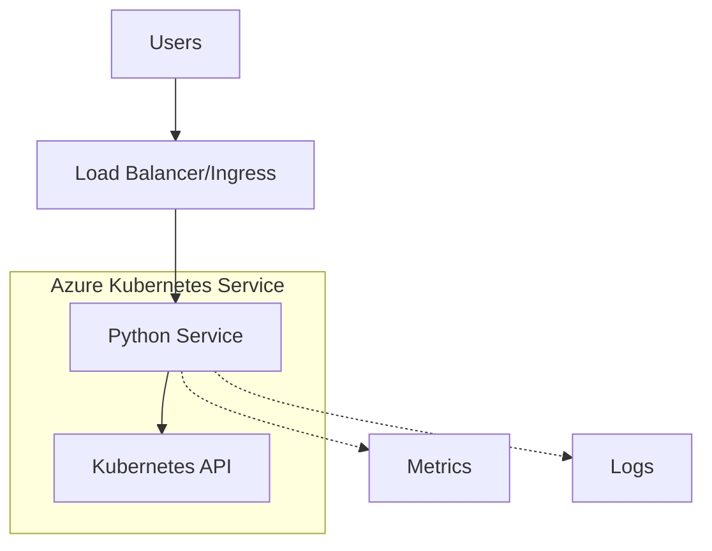

# Architecture & Design

## System Context

## Technology Stack

- **Runtime**: Python 3.11 (Alpine Linux)
- **Framework**: Flask 3.0.3
- **Container Registry**: Docker Hub (rodstewart/python-app)
- **Orchestration**: Kubernetes/AKS
- **Deployment**: Argo CD (GitOps)
- **Ingress**: NGINX Ingress Controller
- **TLS**: cert-manager with Let's Encrypt

## Deployment

The service follows a GitOps pattern:

1. Code changes trigger Azure DevOps pipeline
2. Pipeline builds container and pushes to registry
3. Argo CD detects Helm chart changes
4. Automatic deployment to AKS cluster

## Security Considerations

- Runs as non-root user in container
- TLS termination at ingress level
- Secrets managed via Kubernetes secrets
- Network policies restrict pod communication
